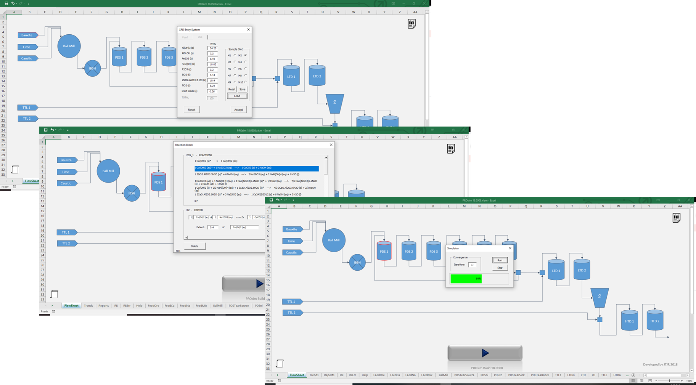
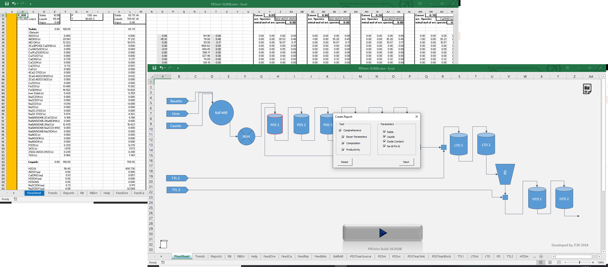

# ProBlend Process Simulating Application

ProBlend is an intuitive process simulation visual basic application designed to predict mineral extraction for the mining industry.  
ProBlend is a result of years of research involving intensive literature survey, kinetics study, sample testing and validation against actual plant processes. It's state-of-the-art incorportion of mineral association chemistry allows it to assess production and provide optimal blending strategies for maximum ore utilization with minimal toxix sludge generation.  
The package was designed to be used by the operators at the plant-site and hence requires little-to-no training. ProBlend comes with built-in database and requires minimal installation. 

## ProBlend - Simple. Robust. Intuitive.
&emsp;&emsp;&emsp;&emsp;&emsp;&emsp;&emsp;<b><i>"Simplicity boils down to two steps:</i></b>
 

<b><i>Identify the essential... Eliminate the rest."</i><b>

    
<i>&emsp;&emsp;&emsp;&emsp;&emsp;&emsp;&emsp;&emsp;&emsp;&emsp;&emsp;&emsp;&emsp;&emsp;&emsp;-Leo Babauta</i>
 
<b>ProBlend works seamlessly for adding new chemistry and loading data. It is fast, reliable and can be debugged easily!</b> 

  
<b>Generating Reports in ProBlend is Fast, intuitive and can easily be exported to any format</b>
 

<i><b>Salient Features</b></i> 
* Robust material balance simulation tool
* in-built reaction chemistry database for ready-to-use
* GUI interface with optimal design
* auto-type reaction block editor
* click-on-stream feature
* optimal OreBlend strategy
* iterative solver for recycle stream calculations
* auto-sample memory loader
* mineral association consideration
* intuitive reports generator
* easy-to-use; requires no additional training
* minimal installation required

## About ProBlend  
ProBlend V18.0508 is specifically developed to simulate the Red Side Bayer Alumina Process pertinent to Central India bauxite. For other models and any inquiries please contact <a href="mailto:krzegy@gmail.com">email</a>

It is an invaluable process simulation tool that can help to provide tremenduous insight into the process operations. This knowledge can translate into:
- Better decision making
- Improved process perforance
- Cost savings
- Reducing enviormental waste
- Efficient and knowledgable plant operators

## Setup
<b>Requirements</b> 
    - ProBlend Latest release 
    - license key (currently, distribution is limited and available for educational purposes only) 
    
<b>Instructions</b> 
    - Enter license key at prompt and then begin using ProBlend! 
